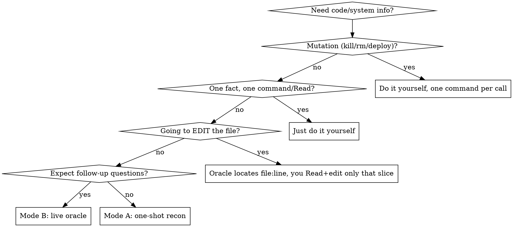

# Code Oracle

## Overview

The expensive resource is tokens in **your** window. Reading a 2000-line file into your context costs you that whole file for the rest of the task; reading it into a subagent's context costs you only the subagent's answer.

**Core principle: investigation reads — files AND command output — belong in a subagent's context, not yours. Spawn a subagent to do the reading; get back answers, not raw content. When you'll have follow-up questions, keep the subagent ALIVE and ask it more via `SendMessage` — it already holds the files, so each question is cheap for you.**

Doing narrow grep/awk gymnastics yourself to avoid a full read is the anti-pattern this replaces: it still burns your context and gives you a fragmentary picture. Let a subagent read fully instead. (Locating one known target with a single `grep`/`Read` is fine — the ban is on grep/awk used as a *substitute for understanding*, fragment by fragment, in your own context. Inside the oracle, `Grep`/`Glob` to FIND files and then `Read` them fully is exactly right.)

## Two Modes

### Mode A — one-shot recon (discrete diagnostic / cleanup)
A single bounded question: "what's running / why did this fail / what's safe to delete." Subagent runs commands one at a time and returns a synthesis. It dies after.

Report shape: **Ran / Found / Analysis / Recommended next actions.**

### Mode B — live code oracle (understanding, with follow-ups)
You need to understand code and will keep asking about it. Spawn an oracle subagent that reads the relevant files **FULLY** into its own window, becomes your reference for that area, and returns an initial map + its `agentId`. Then every follow-up ("how does X work? who calls Y? where is Z handled?") goes to that **same** subagent via `SendMessage(to: agentId)`. It answers from loaded context; you never load the files.

## When to Use Which



You must read what you **edit** — the oracle is for understanding and navigation, not editing. Use it to find the exact `file:line`, then Read and edit only that slice yourself.

## Scoping the Reading List (graph-assisted)

Before spawning the oracle, decide WHICH files it should load. Guessing by directory name over-reads; the structural graph answers this precisely.

Check once per session: `command -v code-review-graph`.

- **Available** → read [graph.md](graph.md) and use it to compute the oracle's reading list (impact radius, review context, architecture overview) and to answer purely structural questions ("who calls X?") without spawning anything.
- **Not available** → offer to install it now: `pipx install code-review-graph` (fully local, no API keys; this is the recommended setup and most of the scoping value). If the user agrees, install, then proceed with [graph.md](graph.md). Only if the user declines or installation is impossible (no Python 3.10+, offline), scope by hand: `Glob`/`Grep` to identify the candidate file set, then give the oracle directories or explicit paths.

## Spawning the Oracle (Mode B)

1. `Agent` with `subagent_type: mnemon:oracle` (falls back to `general-purpose` with the prompt template below if plugin agents are unavailable in your runtime). **Not `Explore`** — Explore reads excerpts, not whole files; the oracle must hold full files. **Never a small/haiku-class model** — default `sonnet`. Choose `opus` only when the code itself needs heavy reasoning (subtle concurrency, intricate algorithms), NOT because the file is large. If the area is too big for one window, split it across several oracles by sub-area — don't reach for a bigger model.
2. For a very large initial load, consider `run_in_background: true` and keep working until it signals ready.
3. **Reuse the same oracle** for every follow-up via `SendMessage` — do NOT spawn a fresh `Agent` per question (that re-reads everything and wastes tokens).

### How the live conversation works (the mechanism)
The `Agent` result returns an `agentId`. To ask a follow-up, call `SendMessage(to: agentId)` — the harness resumes that same agent **with its prior context intact** (it keeps everything it read). A new `Agent` call inherits none of it. This depends on the `SendMessage` tool being available (it is in Claude Code). If addressable persistent agents are NOT available in your runtime, do not fake the oracle: fall back to one richer recon pass (Mode A), or read the needed slice yourself.

### Oracle initial prompt template
```
You are my persistent reference for <module/area>. Read these files FULLY
with Read (whole files — NOT grep/awk fragments): <paths / dir>.
Build a complete mental model and keep it loaded; I will ask follow-ups.

Bash hygiene (subagents don't inherit session instructions): use
Read/Grep/Glob instead of cat/grep/find/sed/echo. One Bash call = one
command, no `&&`, no `;`, no `echo` banners. Do NOT dispatch further
subagents.

Return now: a short map — each file you read + what it does — and confirm
you're ready for questions. Do NOT dump file contents back to me.

For every later question: answer precisely and cite `file:line` so I can
jump straight there. Answer the question; never paste whole files.
```

If code-review-graph is available, append to the prompt: the graph-derived reading list, plus a note that the oracle may run read-only `code-review-graph` queries (see [graph.md](graph.md)) for structural questions instead of grepping.

### Recon prompt template (Mode A)
Same hygiene + "do NOT dispatch further subagents", read-only, and: `Report back exactly — Ran / Found (key facts, no dumps) / Analysis / Recommended next actions (flag any mutation I should run myself).`

## Common Mistakes

- Grep/awk gymnastics yourself "just this once" → that's the baseline this skill replaces; delegate the reading.
- Re-spawning a fresh `Agent` per follow-up → it re-reads everything; `SendMessage` the live oracle instead.
- Using `Explore` as the oracle → it reads excerpts, not whole files; use the oracle agent and tell it to read fully.
- Letting the oracle paste whole files back → defeats the point; require targeted answers + `file:line`.
- Delegating an edit → you must read what you edit; oracle locates, you Read+edit the minimal slice.
- Guessing the reading list by directory name when a graph is one command away → check for code-review-graph first.
- Letting a subagent run `kill`/`rm`/`deploy` → mutations stay with you, one command per call.

## Red Flags — STOP

- Typing a 2nd/3rd narrow `grep`/`awk` on the same file to dodge a full read.
- About to `Read` a big file (or many files) just to answer one question.
- Re-spawning an agent to ask something the last one already loaded.
- Asking an oracle "who calls X?" when the graph answers it in milliseconds.

All of these → delegate to a subagent (oracle for understanding, recon for diagnostics), or run one command/Read per call for mutations and single facts.
