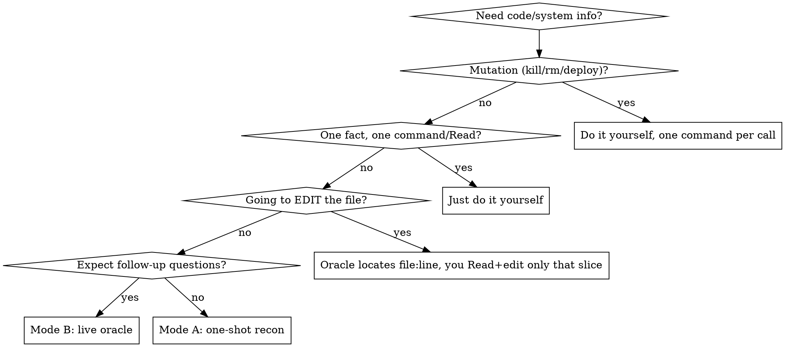

# Code Oracle

## Overview

The expensive resource is tokens in **your** window. Reading a 2000-line file into your context costs you that whole file for the rest of the task; reading it into a subagent's context costs you only the subagent's answer.

**Core principle: investigation reads belong in a subagent's context, not yours. Spawn a subagent to do the reading; get back answers, not raw content. When you'll have follow-up questions, keep the subagent ALIVE and ask it more via `SendMessage` — it already holds the material, so each question is cheap for you.**

A "read" is anything bulky you pull in to *understand* rather than to act on — and it is not only local files:

- **Local code & files** — a module, a flow, a config.
- **Command output** — logs, `ps`/`docker`/`systemctl` dumps, test output.
- **External research on one topic** — a public-API reference, a database schema, "what's the current state of X", a spec, release notes, an unfamiliar tool's behavior. WebSearch + WebFetch (or query the source) into the oracle, not into yourself.
- **A GitHub repo you don't own locally** — decide *up front* how much you'll need, and fetch only that:
  - *A few known files* → WebFetch those specific `raw.githubusercontent.com` files in full. ("Fully" means each file you fetch whole — not the whole repo because one file in it matters.) No download needed.
  - *Broad coverage / a heavy repo* → don't WebFetch source page by page, and don't silently download gigabytes. **Ask the user first**, e.g. *"looks like this needs broad reading of `repo/name` — clone it and run code-review-graph on the clone so scoping is easy?"* On yes, clone the **whole** repo to a context-appropriate spot (a scratch dir like `/tmp/<name>` for a throwaway look; `.refs/<name>` or the project's reference dir when it's a durable reference for the work — mind the sandbox, a subagent's reads may be confined to the project tree, so prefer an in-tree path when unsure), build a graph on it, and hand the oracle a graph-scoped reading list. From there it's a normal code oracle over the clone.

Doing narrow grep/awk gymnastics yourself to avoid a full read — or fetching web page after web page into your own context to piece a topic together — is the anti-pattern this replaces: it still burns your context and gives you a fragmentary picture. Let a subagent read fully instead. ("Fully" is per-source — one file, one page, one schema read whole — not vacuuming an entire repo. Locating one known target with a single `grep`/`Read`, or one quick `WebFetch` for a single fact, is fine — the ban is on fragment-by-fragment gathering used as a *substitute for understanding*, in your own context. Inside the oracle, `Grep`/`Glob`/`WebSearch` to FIND and then `Read`/`WebFetch` fully is exactly right.)

## Two Modes

### Mode A — one-shot recon (discrete diagnostic / cleanup / lookup)
A single bounded question: "what's running / why did this fail / what's safe to delete / what does this API's auth flow look like." Subagent runs the commands or fetches the sources one at a time and returns a synthesis. It dies after.

Report shape: **Ran / Found / Analysis / Recommended next actions.**

### Mode B — live oracle (understanding, with follow-ups)
You need to understand something and will keep asking about it — a code area **or one research topic**. Spawn an oracle subagent that reads the relevant material **FULLY** into its own window, becomes your reference for it, and returns an initial map + its `agentId`. Then every follow-up goes to that **same** subagent via `SendMessage(to: agentId)`. It answers from loaded context; you never load the material.

- *Code area*: "how does X work? who calls Y? where is Z handled?" The oracle holds the files.
- *Research topic*: "does this public API support cursor pagination? what changed in the last release? how does repo R wire up its plugin manifests?" The oracle holds the docs / fetched pages / cloned repo. Same economics — you pay for answers, never for the pages.

## When to Use Which



You must read what you **edit** — the oracle is for understanding and navigation, not editing. Use it to find the exact `file:line`, then Read and edit only that slice yourself.

## Scoping the Reading List (graph-assisted)

Before spawning the oracle, decide WHICH files it should load. Guessing by directory name over-reads; the structural graph answers this precisely.

Check once per session: `command -v code-review-graph`.

- **Available** → read [graph.md](graph.md) and use it to compute the oracle's reading list (impact radius, review context, architecture overview) and to answer purely structural questions ("who calls X?") without spawning anything.
- **Not available** → offer to install it now: `pipx install code-review-graph` (fully local, no API keys; this is the recommended setup and most of the scoping value). If the user agrees, install, then proceed with [graph.md](graph.md). Only if the user declines or installation is impossible (no Python 3.10+, offline), scope by hand: `Glob`/`Grep` to identify the candidate file set, then give the oracle directories or explicit paths.

## Spawning the Oracle (Mode B)

1. `Agent` with `subagent_type: mnemon:oracle` (falls back to `general-purpose` with the prompt template below if plugin agents are unavailable in your runtime). **Not `Explore`** — Explore reads excerpts, not whole files; the oracle must hold full files. **Never a small/haiku-class model** — default `sonnet`. Choose `opus` only when the code itself needs heavy reasoning (subtle concurrency, intricate algorithms), NOT because the file is large. If the area is too big for one window, split it across several oracles by sub-area — don't reach for a bigger model.
2. For a very large initial load, consider `run_in_background: true` and keep working until it signals ready.
3. **Reuse the same oracle** for every follow-up via `SendMessage` — do NOT spawn a fresh `Agent` per question (that re-reads everything and wastes tokens).

### How the live conversation works (the mechanism)
The `Agent` result returns an `agentId`. To ask a follow-up, call `SendMessage(to: agentId)` — the harness resumes that same agent **with its prior context intact** (it keeps everything it read). A new `Agent` call inherits none of it. This depends on the `SendMessage` tool being available (it is in Claude Code). If addressable persistent agents are NOT available in your runtime, do not fake the oracle: fall back to one richer recon pass (Mode A), or read the needed slice yourself.

### Oracle initial prompt template
```
You are my persistent reference for <module/area>. Read these files FULLY
with Read (whole files — NOT grep/awk fragments): <paths / dir>.
Build a complete mental model and keep it loaded; I will ask follow-ups.

Bash hygiene (subagents don't inherit session instructions): use
Read/Grep/Glob instead of cat/grep/find/sed/echo. One Bash call = one
command, no `&&`, no `;`, no `echo` banners. Do NOT dispatch further
subagents.

Return now: a short map — each file you read + what it does — and confirm
you're ready for questions. Do NOT dump file contents back to me.

For every later question: answer precisely and cite `file:line` so I can
jump straight there. Answer the question; never paste whole files.
```

If code-review-graph is available, append to the prompt: the graph-derived reading list, plus a note that the oracle may run read-only `code-review-graph` queries (see [graph.md](graph.md)) for structural questions instead of grepping.

### Research oracle prompt template (Mode B, external sources)
```
You are my persistent reference for <topic — e.g. "the Stripe Billing API"
/ "the current state of Codex CLI subagents" / "how repo R is structured">.
Pull the primary sources FULLY into your own context, not mine:
- WebSearch for the authoritative docs/spec, then WebFetch and read each in full.
- For a GitHub repo: if only a few files matter, WebFetch those raw files whole;
  if it's heavy or you need broad coverage, `git clone --depth 1 <url> <path>`
  and Read the files that matter (don't WebFetch source page by page).
Prefer primary sources over summaries; note recency/version.

Return now: a short map — each source you read + one line on what it is — and
confirm you're ready for questions. Do NOT paste pages back.

For every later question: answer precisely, cite the `URL` + section (or repo
`path:line`), quote only the few lines that prove the point.
```

### Recon prompt template (Mode A)
Same hygiene + "do NOT dispatch further subagents", read-only, and: `Report back exactly — Ran / Found (key facts, no dumps) / Analysis / Recommended next actions (flag any mutation I should run myself).`

## Platform Adaptation

This skill is written in Claude Code tool names. On other runtimes, read them through the per-platform map — the skill body doesn't change:

- **Codex CLI** → [references/codex-tools.md](references/codex-tools.md). Key mappings: `Agent`/`Task` → `spawn_agent` (needs `[features] multi_agent = true` in `~/.codex/config.toml`); the live oracle's `SendMessage` follow-ups → re-prompting the same open agent thread (don't `close_agent` until done). Install via the Codex plugin manifest (`.codex-plugin/plugin.json`, `"skills": "./skills/"`).
- **Other runtimes** → the oracle pattern needs one capability: a subagent thread that stays addressable across follow-ups. Where a runtime has it, Mode B works; where it doesn't, fall back to one richer Mode A recon pass rather than faking persistence by re-spawning. `code-review-graph` is an external CLI and behaves identically everywhere.

## Common Mistakes

- Grep/awk gymnastics yourself "just this once" → that's the baseline this skill replaces; delegate the reading.
- Re-spawning a fresh `Agent` per follow-up → it re-reads everything; `SendMessage` the live oracle instead.
- Using `Explore` as the oracle → it reads excerpts, not whole files; use the oracle agent and tell it to read fully.
- Letting the oracle paste whole files/pages back → defeats the point; require targeted answers + `file:line` / `URL`.
- Delegating an edit → you must read what you edit; oracle locates, you Read+edit the minimal slice.
- Guessing the reading list by directory name when a graph is one command away → check for code-review-graph first.
- WebFetching page after page (or cloning + browsing a repo) into your OWN context to research one topic → that's a "read"; send it to a research oracle (Mode B).
- Letting a subagent run `kill`/`rm`/`deploy` → mutations stay with you, one command per call.

## Red Flags — STOP

- Typing a 2nd/3rd narrow `grep`/`awk` on the same file to dodge a full read.
- About to `Read` a big file (or many files) just to answer one question.
- Re-spawning an agent to ask something the last one already loaded.
- Asking an oracle "who calls X?" when the graph answers it in milliseconds.

All of these → delegate to a subagent (oracle for understanding, recon for diagnostics), or run one command/Read per call for mutations and single facts.
